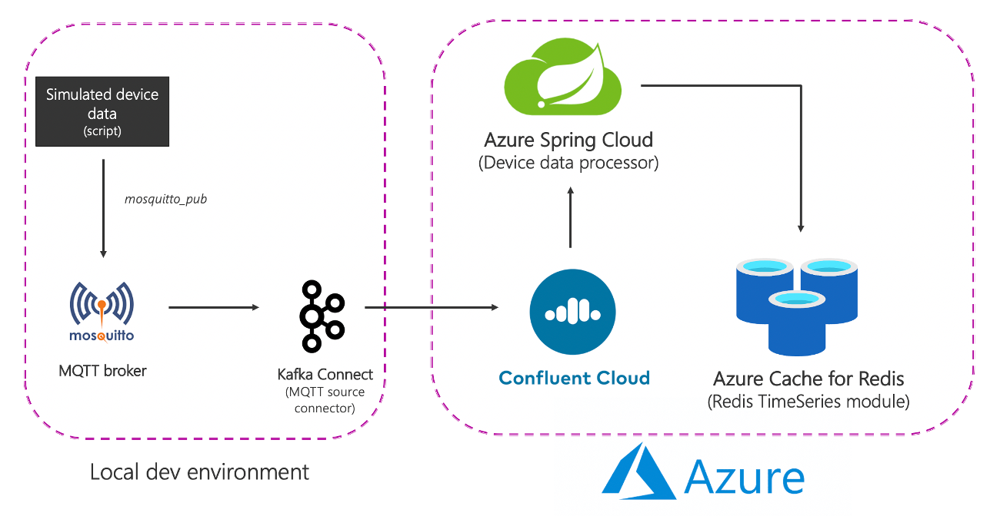

# Time Series data with Redis and Apache Kafka

A practical example of how to use [RedisTimeSeries](https://redisearch.io/) with Apache Kafka for analyzing time series data.

**blog post coming soon**



## Scenario

Imagine there are many locations, each of them has multiple devices and you're tasked with the responsibility to monitor device metrics - we will consider temperature and pressure. These metrics will be stored in `RedisTimeSeries` (of course!) and use the following naming convention for keys - `<metric name>:<location>:<device>`. For e.g. temperature for device `1` in location `5` will be represented as `temp:5:1`. Each time series data point will also have the following Labels (key value pairs) - metric, location, device. This is to allow for flexible querying as you will see in the upcoming sections.
Here are a couple of examples to give you an idea of how you would add data points using the TS.ADD command:

```bash
# temperature for device 2 in location 3 along with labels
TS.ADD temp:3:2 * 20 LABELS metric temp location 3 device 2

# pressure for device 2 in location 3
TS.ADD pressure:3:2 * 60 LABELS metric pressure location 3 device 2
```

## Solution architecture

End-to-end flow:

- A script produces simulated device data that is sent to the local MQTT broker.
- This data is picked up by the MQTT Kafka Connect source connector and sent to a topic in the Confluent Cloud Kafka cluster running in Azure.
- It is further processed by the Spring Boot application hosted in Azure Spring Cloud which then persists it to the Azure Cache for Redis instance.

Individual services:

- Source (local) components
    - MQTT broker (mosquitto): MQTT is a de-facto protocol for IoT use cases. The scenario we will be using is a combination of IoT and Time Series - more on this later.
    - Kafka Connect: The MQTT source connector is used to data from MQTT broker to a Kafka cluster.
    
- Azure services
    - [Azure Cache for Redis Enterprise Tiers](https://docs.microsoft.com/azure/azure-cache-for-redis/quickstart-create-redis-enterprise?WT.mc_id=data-17927-abhishgu): The Enterprise tiers are based on Redis Enterprise, a commercial variant of Redis from Redis Labs. In addition to RedisTimeSeries, Enterprise tier also supports RediSearch and RedisBloom.
    - [Confluent Cloud on Azure](https://docs.microsoft.com/azure/partner-solutions/apache-kafka-confluent-cloud/overview?WT.mc_id=data-17927-abhishgu): A fully-managed offering that provides Apache Kafka as a service, thanks to an integrated provisioning layer from Azure to Confluent Cloud.
    - [Azure Spring Cloud](https://docs.microsoft.com/azure/spring-cloud/?WT.mc_id=data-17927-abhishgu): Deploying Spring Boot microservices to Azure is easier, thanks to Azure Spring Cloud, which does all the heavy lifting so developers can focus on their code.

